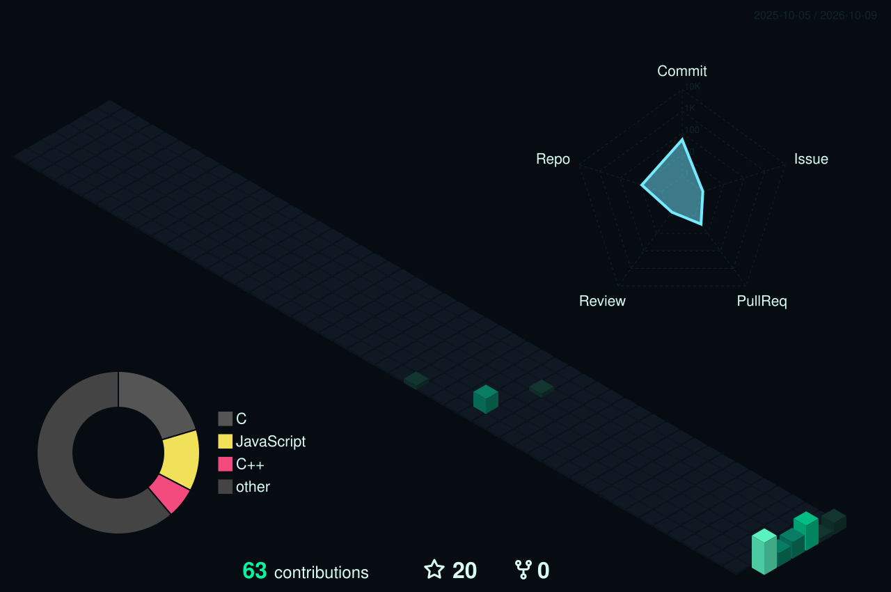
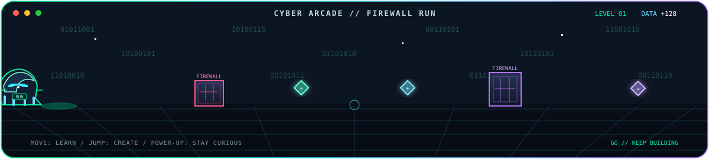

  

<h1 align="center">🛡️ Clark Pasamba <code>//</code> Student &amp; Developer ⚡</h1>

  

  
  
  

<code>01 / LEARN</code> <b>→</b> <code>02 / BUILD</code> <b>→</b> <code>03 / DEFEND</code> <b>→</b> <code>04 / REPEAT</code>

---

## 🛰️ `01 / IDENTITY` &nbsp; Operator Profile

I’m a hardworking student interested in how technology works—and how to make it more secure. I enjoy building software, creating visual content, and exploring cybersecurity with a responsible, defender-first mindset.

I also bring leadership experience, clear communication, customer service, and adaptability to the teams I work with. I value curiosity, thoughtful collaboration, and steady improvement.

## 🎯 `02 / OBJECTIVES` &nbsp; Mission Console

| Signal | Current focus |
|:--|:--|
|  | Security fundamentals, secure systems, and responsible cybersecurity learning |
|  | Programs and web experiences made through hands-on practice |
|  | Video editing and graphic design |
|  | Leadership, communication, customer service, and adaptability |

## ⚡ `03 / BUILD` &nbsp; Development Arsenal

  
  
  
  
  
  
  
  

  
<strong>▸ Open extended toolkit</strong>

   

  **Development & data**  
  
  
  
  
  
  
  
  
  
  

  **Cloud, databases & platforms**  
  
  
  
  
  
  
  
  
  

  **Creative & version control**  
  
  
  
  

## 🎨 `04 / CREATIVE MODE` &nbsp; Offscreen

Away from the terminal, I enjoy **video editing** and **graphic design**. These creative interests help me bring a visual perspective to the things I build.

## 📡 `05 / CONNECT` &nbsp; Secure Channel

  
  
  
  
  

## 🧬 `06 / LIVE TELEMETRY` &nbsp; Activity Radar

  
  
  

  
  

  

## 🟩 `07 / CONTRIBUTION GRID` &nbsp; 3D Contribution Matrix

  

  
  
  

  <code>SESSION ACTIVE</code> &nbsp;·&nbsp; Stay curious <b>✦</b> Build responsibly <b>✦</b> Keep learning

  

